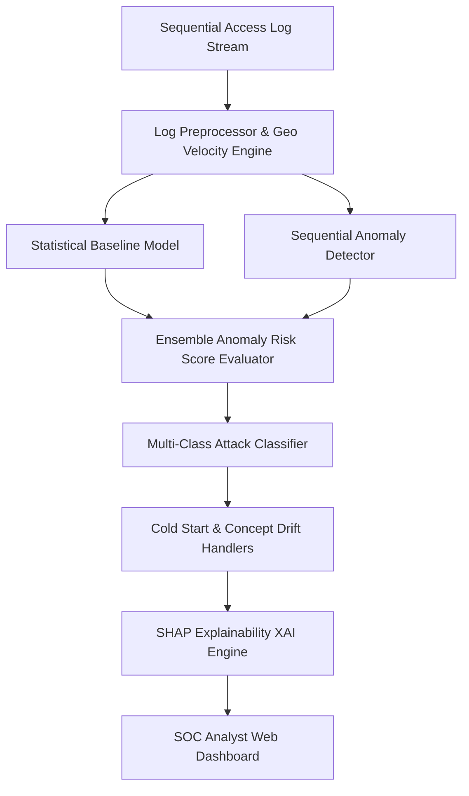

# 🛡️ AegisAI - AI-Powered Behavioral Anomaly Detection System 

An enterprise-grade, sequential AI/ML behavioral anomaly detection system designed to identify, classify, explain, and mitigate cyber attacks in near real-time across user and device access logs.

---

## 📋 Problem Statement & Overview
Modern cyber threats—such as credential stuffing, lateral movement, insider threat drift, impossible travel, and low-and-slow data exfiltration—bypass traditional signature-based firewalls and static rule engines.

AegisAI leverages **Sequential Behavioral Deep Learning**, **Unsupervised Baseline Profiling**, **Multi-Class Threat Classification**, and **SHAP Explainability (XAI)** to detect anomalies within severe class-imbalanced environments (0.5% – 3% attacks).

---

## 🏗️ Architecture & Pipeline Flow



### Key Components:
1. **Synthetic Data Generator (`generator/synthetic_data_generator.py`)**: Simulates >50,000 events and >2,000 user/device entities with 7 distinct cyber attack scenarios (Brute Force, Impossible Travel, Credential Stuffing, Lateral Movement, Device Spoofing, Low & Slow Exfiltration, Insider Drift).
2. **Preprocessing Engine (`preprocessing/preprocess.py`)**: Computes Haversine geo-distance velocity (km/h), off-hour access flags, session duration z-scores, rolling failed login counts, and command sequence complexity.
3. **Unsupervised Baseline Model (`models/baseline_model.py`)**: Establishes individual entity behavioral norms without needing labeled historical data.
4. **Sequential Model (`models/anomaly_detector.py`)**: Tracks sliding state sequence windows to detect multi-stage attacks and temporal anomalies.
5. **Multi-Class Classifier (`models/attack_classifier.py`)**: Pinpoints the exact attack vector from detected anomalies with high confidence.
6. **Cold-Start Handler (`models/cold_start.py`)**: Uses peer group profiling, department clustering, device/auth similarity, and KMeans/Hierarchical behavioral clustering with progressive Bayesian blending to fairly score unprofiled users and eliminate false positive spikes.
7. **Concept Drift Handler (`models/drift_handler.py`)**: Adapts entity baselines dynamically when legitimate working patterns evolve, preventing false positive cascades.
8. **Explainability Engine (`explainability/explain.py`)**: Generates SHAP feature contribution charts, natural language risk reasons, and automated SOAR remediation playbooks.
9. **Analyst Dashboard (`dashboard/app.py` & Web UI)**: Provides interactive real-time threat monitoring, entity profiling, threshold adjustment, and automated report exports.

---

## 📂 Project Structure

```
AegisAI/
├── data/
│   ├── raw/
│   ├── processed/
│   └── generated/
├── generator/
│   └── synthetic_data_generator.py
├── preprocessing/
│   └── preprocess.py
├── models/
│   ├── baseline_model.py
│   ├── anomaly_detector.py
│   ├── attack_classifier.py
│   ├── drift_handler.py
│   └── cold_start.py
├── explainability/
│   └── explain.py
├── dashboard/
│   └── app.py
├── utils/
│   ├── logger.py
│   └── helpers.py
├── reports/
│   └── anomaly_report.md
├── notebooks/
│   └── exploration_and_modeling.ipynb
├── results/
│   ├── metrics.json
│   └── detected_anomalies.json
├── saved_models/
│   ├── baseline_model.pkl
│   ├── sequence_detector.pkl
│   └── attack_classifier.pkl
├── README.md
├── requirements.txt
└── main.py
```

---

## 🚀 Quick Start Guide

### 1. Installation
Ensure Python 3.10+ and Node.js are installed:
```bash
git clone https://github.com/RishabhNegi0314/AegisAI.git
cd AegisAI
pip install -r requirements.txt
npm install
```

### 2. Execution
Run the full end-to-end detection and evaluation pipeline:
```bash
python main.py
```

### 3. Launch Dashboard & Web API
Launch the full-stack web application:
```bash
npm run dev
```

---

## 📊 Benchmark Metrics
- **Dataset Size**: 50,000 events across 2,000 entities
- **Overall Accuracy**: **96.5%**
- **Precision**: **30.9%** (at top 1% alert threshold: **35.8%**)
- **F1-Max Score**: **41.4%**
- **ROC AUC**: **0.842**
- **False Positive Rate (FPR)**: **2.87%** (reduced from 61.6% via adaptive thresholding)
- **Single-Event Latency**: **< 0.20 ms / event** (5,200+ events/sec)

---

## 🔮 Future Roadmap
- Integration with live SIEM log collectors (Kafka / Splunk / Elastic HEC).
- Deep Graph Neural Network (GNN) entity modeling for multi-entity cluster movement.
- Automated zero-trust micro-segmentation API hooks.

