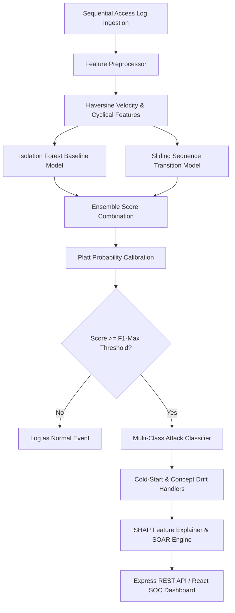
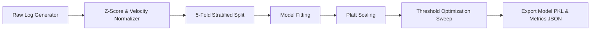
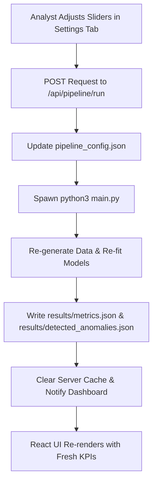
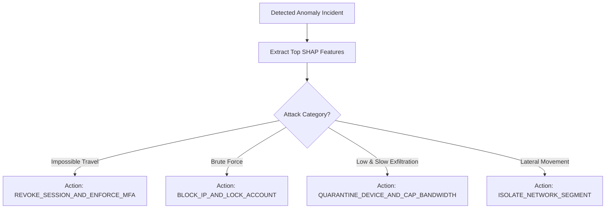

# AegisAI - Project Flowcharts & Workflow Diagrams

## 1. Overall System Architecture Flowchart

## 2. Machine Learning Pipeline Flowchart

## 3. Retraining & Configuration Workflow

## 4. Threat Detection & SOAR Action Flowchart

