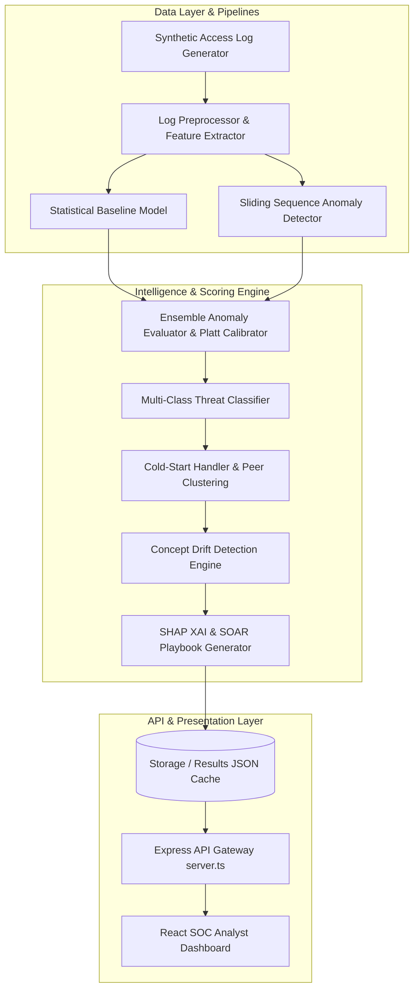
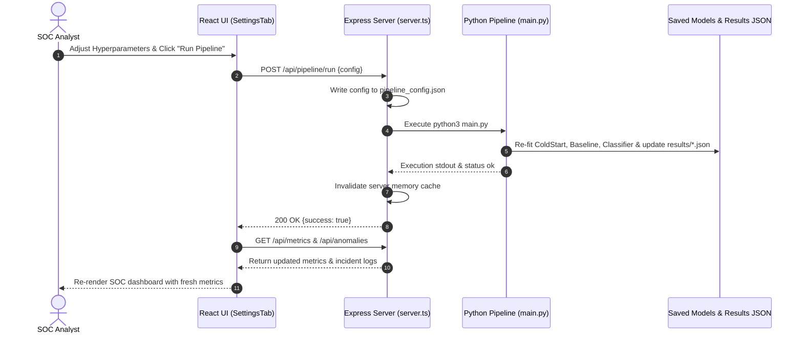

# AegisAI - System Architecture Document

## 1. High-Level Architecture Overview
AegisAI is built as a hybrid, full-stack cybersecurity behavioral anomaly detection platform. It combines a high-performance Python machine learning engine with an Express + Node.js backend and a React + Vite + Tailwind CSS SOC web dashboard.

## 2. Component Interaction & Data Flow
1. **Log Stream Ingestion**: `generator/synthetic_data_generator.py` generates 50,000+ sequential access logs across 2,000+ user and device entities.
2. **Feature Engineering**: `preprocessing/preprocess.py` transforms raw logs into numerical vector streams (Haversine velocity, time-of-day sine/cosine transforms, z-scores for session duration, rolling failure counters).
3. **Dual Detection Engine**:
   - `models/baseline_model.py`: Calculates entity z-score deviation and Isolation Forest distance.
   - `models/anomaly_detector.py`: Scans sequence state transitions using sliding state matrices.
4. **Ensemble Scoring & Calibration**: `models/evaluator.py` combines normalized scores, applies Platt probability scaling, and computes optimal decision thresholds ($T_{f1\_max}$).
5. **Threat Classification & Special Handlers**:
   - `models/attack_classifier.py`: Maps anomalies to 7 distinct attack scenarios.
   - `models/cold_start.py`: Profiles new unestablished entities using KMeans & Hierarchical peer grouping with Bayesian prior blending.
   - `models/drift_handler.py`: Detects legitimate behavioral shifts (gradual/sudden) while isolating attack spikes.
6. **Explainability & Automation**: `explainability/explain.py` computes SHAP values, risk factor breakdowns, and SOAR playbooks.
7. **REST API & Web UI**: `server.ts` exposes cached JSON state and triggers pipeline re-executions, feeding `src/App.tsx` and its tabbed views.

## 3. Retraining Workflow Sequence Diagram

## 4. Key Subsystem Design Highlights
- **Cold-Start Subsystem**: Eliminates initial false positive floods by grouping new entities into 4 hierarchical clusters and blending cluster priors ($W_{cluster}$) with entity evidence ($W_{entity} = \min(1, N_{events} / N_{warmup})$).
- **Concept Drift Subsystem**: Monitors Page-Hinkley cumulative sum and Kolmogorov-Smirnov distribution shifts over sliding windows, updating baseline standard deviations safely without learning malicious attack spikes.
- **Explainability Subsystem**: Combines model-agnostic feature perturbation / SHAP approximations with rule-based security rationale generation.
